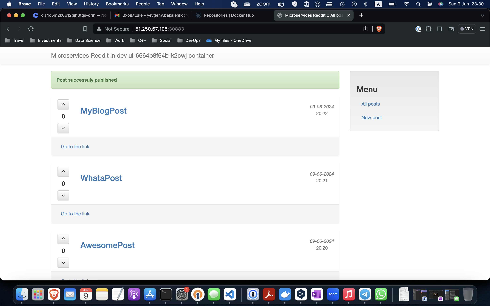

# YBakalenko_micorservices

## Ingress-контроллеры и сервисы в Kubernetes (kubernetes-3)
 - Поменял скейл для kube-dns и обнаружил, что он исчезает, вернул его на место
 - Поменял тип `ui-service` на `LoadBalancer`
 - Импортировал компонент для создания `IngressController`-а. Правильная команда всё же такая:
   `kubectl apply -f https://raw.githubusercontent.com/kubernetes/ingress-nginx/main/deploy/static/provider/cloud/deploy.yaml`
   В случае конфликтов с предыдущими версиями API выполнить:
   ```
   kubectl delete job ingress-nginx-admission-create -n ingress-nginx
   kubectl delete job ingress-nginx-admission-patch -n ingress-nginx
   ```
   Затем заново применить `deploy.yaml`
 - Добавил ui-ingress для доступа к `ui-service`
   Учел, что нужно в манифесте переходить на `apiVersion: networking.k8s.io/v1`, а также в спецификации указывать `ingressClassName: nginx`
 - Открыл список ingress-ов, посмотрел IP единственного доступного, открыл его в браузере, увидел работающее приложение
 - Далее подготовил сертификат используя IP как CN
   `openssl req -x509 -nodes -days 365 -newkey rsa:2048 -keyout tls.key -out tls.crt -subj "/CN=158.160.164.213"`
   И загрузил сертификат в кластер kubernetes
 - Накатил сетевые политики `mongo-network-policy.yml`, чтобы в mongo ходили только `comment` и `post`
 - Создал диск для PersistentVolume хранилища в Yandex Cloud:
   `yc compute disk create --name k8s --size 4 --description "disk for k8s"`
   `kubectl apply -f mongo-volume.yml`
   Выделил PersistentVolumeClaim для нашего mongo:
   `kubectl apply -f mongo-claim.yml`
   И пересоздал Deplyment mongo
   `kubectl delete deployment mongo -n dev`
   `kubectl apply -f mongo-deployment.yml -n dev`
   Посты в базе остались на своем месте

## Основные модели безопасности и контроллеры в Kubernetes (kubernetes-2)

 - Установил локально `minikube`
 - Поднял и отладил в нем приложение
 - Создал кластер на Yandex Cloud
 - Поднял приложение в кластере на Yandex Cloud
 - Приложил (на всякий случай) картинку с web-интерфейсом:
   

## Введение в Kubernetes #1 (kubernetes-1)
### Prepare system
1. Update system registry
   `sudo apt update`
2. Disable swap
   `sudo swapoff -a`
   `sudo sed -i '/ swap / s/^\(.*\)$/#\1/g' /etc/fstab`
3. Setup overlay and netfilter
   > sudo tee /etc/modules-load.d/containerd.conf <<EOF
overlay
br_netfilter
EOF

   `sudo modprobe overlay`
   `sudo modprobe br_netfilter`
4. Set core parameters for Kubernetes
   > sudo tee /etc/sysctl.d/kubernetes.conf <<EOF
net.bridge.bridge-nf-call-ip6tables = 1
net.bridge.bridge-nf-call-iptables = 1
net.ipv4.ip_forward = 1
EOF

   `sudo sysctl --system`
5. Add docker key and repo
   `sudo curl -fsSL https://download.docker.com/linux/ubuntu/gpg | sudo gpg --dearmour -o /etc/apt/trusted.gpg.d/docker.gpg`
   `sudo add-apt-repository "deb [arch=amd64] https://download.docker.com/linux/ubuntu $(lsb_release -cs) stable"`
6. Install necessary system components:
   `sudo apt update`
   `sudo apt install -y curl software-properties-common apt-transport-https ca-certificates containerd.io gpg gnupg2`
7. Setup containerd:
   `containerd config default | sudo tee /etc/containerd/config.toml >/dev/null 2>&1`
   `sudo nano /etc/containerd/config.toml` and set `sandbox_image = "registry.k8s.io/pause:3.9"`
   `sudo sed -i 's/SystemdCgroup \= false/SystemdCgroup \= true/g' /etc/containerd/config.toml`
   `sudo systemctl restart containerd`
   `sudo systemctl enable containerd`
8. Add Kubernetes key and repo:
   `curl -fsSL https://pkgs.k8s.io/core:/stable:/v1.30/deb/Release.key | sudo gpg --dearmor -o /etc/apt/keyrings/kubernetes-apt-keyring.gpg`
   `echo 'deb [signed-by=/etc/apt/keyrings/kubernetes-apt-keyring.gpg] https://pkgs.k8s.io/core:/stable:/v1.30/deb/ /' | sudo tee /etc/apt/sources.list.d/kubernetes.list`
9. Install kubeadm, kubectl
   `sudo apt-get update`
   `sudo apt-get install -y kubelet kubeadm kubectl`
   `sudo apt-mark hold kubelet kubeadm kubectl`
10. Check kubelet configuration:
   `sudo nano /var/lib/kubelet/config.yaml` and enusre it contains `containerRuntimeEndpoint: unix:///run/containerd/containerd.sock`
   `sudo systemctl restart kubelet`

### Установка роли master
1. Initialize the Kubernetes control-plane node (master)
   `sudo kubeadm init --control-plane-endpoint=178.154.201.106 --pod-network-cidr=10.244.0.0/16 --apiserver-cert-extra-sans=178.154.201.106 --apiserver-advertise-address=0.0.0.0`
2. To start using your cluster, you need to run the following as a regular user:
   `mkdir -p $HOME/.kube`
   `sudo cp -i /etc/kubernetes/admin.conf $HOME/.kube/config`
   `sudo chown $(id -u):$(id -g) $HOME/.kube/config`
3. Get container network interface config:
   `curl https://raw.githubusercontent.com/projectcalico/calico/v3.28.0/manifests/calico.yaml -O`
4. Replace CALICO_IPV4POOL_CIDR value `192.168.0.0/16` to `10.244.0.0/16` and `image: docker` or `image: XXX` to `image: mirror.gcr.io`
   `nano calico.yaml`
5. Apply the manifest using the following command.
   `kubectl apply -f calico.yaml`

### Установка роли worker
1. Join node to cluster
   `sudo kubeadm join 178.154.201.106:6443 --token w22flc.83t1skzsi8i360gn --discovery-token-ca-cert-hash sha256:332e8e7b83a12861c172c329782c35ecfc93c1a67a0a244ffa00e185f1454166`

### Удаленное администрирование кластера Kubernetes
1. Copy the kubeconfig file from the master node to your local machine:
   `scp ubuntu@178.154.201.106:/home/ubuntu/.kube/config ~/.kube/config`
2. Set the KUBECONFIG environment variable to point to this file:
   `export KUBECONFIG=~/.kube/config`
3. Check nodes list:
   `kubectl get nodes`


## Применение системы логирования в инфраструктуре на основе Docker
